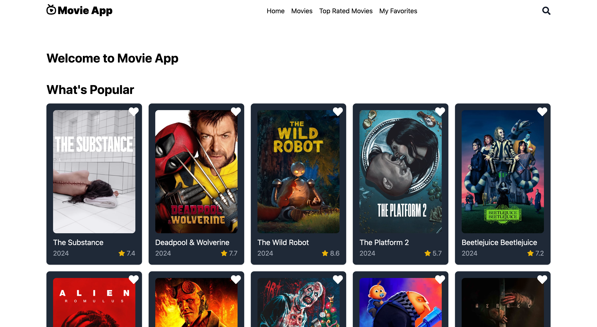

# Movie App



This is a movie listing web application built with React, Redux Toolkit, and The Movie Database (TMDb) API. It allows users to browse popular, top-rated, and upcoming movies, as well as view details for each movie and manage a personal list of favorite movies.

## Live Demo

Check out the live version of the app: [https://movie-app-sage-six.vercel.app/](https://movie-app-sage-six.vercel.app/)

## Features

- **Popular Movies**: Browse the most popular movies currently trending.
- **Top-Rated Movies**: Explore the top-rated movies.
- **Upcoming Movies**: View movies that are soon to be released.
- **Movie Search**: Search for movies by title.
- **Movie Details**: Get detailed information about a movie, including runtime, release date, and rating.
- **Favorite Movies**: Add or remove movies from your favorite list and view them in a dedicated section.

## Technologies Used

- [Vite](https://vitejs.dev/): Vite is a fast development server and build tool for modern web projects.
- [ReactJS](https://react.dev/): Frontend framework for building the user interface.
- [React Router](https://reactrouter.com/en/main): Navigation between different pages (e.g., Home, Movies, Movie Details).
- [Redux Toolkit](https://redux-toolkit.js.org/): State management for handling movie data and favorites.
- [TMDb API](https://developer.themoviedb.org/docs/getting-started): External API used to fetch movie data.
- [Tailwind CSS](https://tailwindcss.com/): For styling the user interface.
- [React Helmet Async](https://github.com/staylor/react-helmet-async): For managing SEO meta tags dynamically in the application.
- [Cypress](https://www.cypress.io/): For end-to-end testing to ensure that the app works as expected.
- [Vercel](https://vercel.com/): For deployment and hosting.


## Installation

1. Ensure you have Node.js installed on your computer.
2. Clone this repository or download it as a ZIP file.
```bash
git clone https://github.com/ozayo/movie-app.git
```
3. Open a terminal and navigate to the project directory.
```bash 
cd movie-app
```
4. Run the following command to install the dependencies:
```bash
npm install
```

5. After the installation is complete, start the application with the command:
```bash
npm run dev
```

6. The application can be accessed through your localhost, go to http://localhost:5173 to view the app.


## Running

#### Create a .env file

Create a .env file in the project root and add your TMDb API key:
```bash  
VITE_API_KEY=your_tmdb_api_key_here 
```

#### Cypress testing
```bash
npx cypress open
```

#### Generate a sitemap.xml
```bash
npm run generate-sitemap
```

#### Generate a robots.txt
For development env
```bash
npm run generate-robots-dev 
```

For production
```bash
npm run generate-robots-prod
```